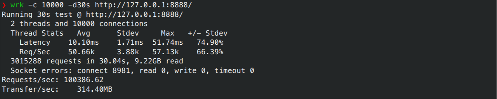

# MiniServer

Linux下使用C++实现的高性能WEB服务器，支持十万的QPS。

## 功能

- 利用IO复用技术`epoll`和线程池实现 `多Reactor多线程网络模型`，减少线程之间的数据竞争，有效控制连接的各种资源
- 基于RAII实现可以自动扩容的数据库连接池，并且可以被动检测并移除过期的连接
- 基于小根堆实现定时器，关闭超时的非活动连接
- 利用`vector<char>`实现自动增长的用户缓冲区，通过分散读 (`readv`)和栈上空间高效处理可读事件
- 支持 `GET` 和 `POST` 请求，通过状态机和正则表达式实现HTTP请求解析，包括请求分成多次`EPOLLIN`事件到达

## 环境要求

- Linux
- C++20
- mysql/mariadb

## 项目运行

### 安装数据库

不同linux发行版对应的安装方法可能不同，项目应该支持mysql和mariadb.

### 安装第三方库

项目中使用cmake引入第三方库 `mysqlpp, spdlog, magic_enum`，所以需要在系统中安装这些库。

### 设置环境变量和配置数据库

项目使用环境变量保存数据库的配置信息，所以需要设置以下这些环境变量

```shell
export MINISERVER_DB_NAME='miniserver'
export MINISERVER_DB_USER='*****'
export MINISERVER_DB_PASSWORD='******'
export MINISERVER_DB_HOST='127.0.0.1'
```

```sql
// 建立miniserver数据库
create dabase miniserver;

// 创建user表
CREATE TABLE user(
    username char(50) NULL,
    password char(50) NULL
)ENGINE=InnoDB;
```

请根据自己的需要修改上面的配置项。

### 编译

在项目主目录下，使用Cmake进行编译，

```shell
cmake -B build
cmkae --build build --parallel
```

### 运行

生成的可执行文件是 `build/src/main`，执行即可

```shell
./build/src/main
```

### 连接

使用浏览器等连接到 `http://127.0.0.1:8888/`。

## 压力测试

压力测试使用的平台为

```txt
CPU: AMD Ryzen 9 5900X (24) @ 3.700GHz
内存: 64GB
OS: Arch Linux x86_64
Kernel: 6.8.9-arch1-2
```

### 修改系统设置

放开程序能够打开的文件描述符的限制

```shell
ulimit -n unlimited
```

修改内核参数 `tcp_max_syn_backlog` 和 `somaxconn`，并在程序中将 `backlog`的值调大，

```shell
echo 10000 > /proc/sys/net/ipv4/tcp_max_syn_backlog
echo 10000 > /proc/sys/net/core/somaxconn
```

如果非root用户，可能需要使用下面的方法调大内核参数

```shell
echo 10000 | sudo tee /proc/sys/net/ipv4/tcp_max_syn_backlog
echo 10000 | sudo tee /proc/sys/net/core/somaxconn
```

这一步的目的是让程序不会因为半连接队列或者全连接队列的容量有效，而导致堵塞。
`ulimit`的设置只在当前shell中有效，内核参数的设置只在这次会话中有效，重启后失效。

### 关闭日志输出

将 src/CmakeLists.txt 中

```shell
target_compile_definitions(${target_name} PRIVATE SPDLOG_ACTIVE_LEVEL=SPDLOG_LEVEL_DEBUG)
```

改成

```shell
target_compile_definitions(${target_name} PRIVATE SPDLOG_ACTIVE_LEVEL=SPDLOG_LEVEL_OFF)
```

并且在 main.cpp 文件 Setting::GetInstance().Init调用中，将 `openLog` 设置为 `false`。

### 结果

将程序线程数量修改为适合当前平台的数量，本实验中设置为 `12`。

使用`wrk`进行压力测试， wrk通过多线程和epoll多路复用技术实现很高的并发连接数。可以看到QPS可以达到`十万`。

```shell
wrk -c 10000 -d30s http://127.0.0.1:8888/

```



## 实现细节

### 多Reactor多线程网络模型

多Reactor多线程网络模型相较于单Reactor多线程网络模型主要有两点优势：

- 线程之间的数据竞争小，对资源的控制比较容易
- 缓解了一个Reactor承担所有事件的监听带来的性能瓶颈

主线程只负责监听连接事件，当连接事件发生后，`accept`连接，并轮流分发给不同的线程，保持不同线程之间的负载均衡。
主线程将`socket`等信息放入线程对应的队列，并通过`eventfd`通知子线程。

`eventfd`相较`pipe`开销更小，且只需要一个文件描述符。主线程每次需要通知子线程时，就向`eventfd`对应的`socket`写入
`1`，而子线程通过`epoll`监听到可读事件，会将当前的计数返回并归零，这样子线程知道有多少个连接在等待子线程接收。

子线程读取对应的消息，之后这些客户端连接就不再需要主线程的参与，如此便减少了数据竞争，并且连接对应的其他资源，比如说 epoll注册事件、读写缓冲区、定时器等
也都不再需要和其他线程共享，当连接关闭时，可以轻松释放这些资源。真正的业务逻辑在子线程实现，子线程的工作流程仿佛它是一个单Reactor单线程程序。

如下，是一个子线程对应的数据成员（资源）和工作函数。

```c++
class ServerHandler {
    void Start() {
        while (true) {
            int timeMs = Setting::GetInstance().timeout == std::chrono::milliseconds(0) ? -1 : timer.GetNextTick(); 
            int eventCnt = epoller.Wait(timeMs);
            for (int i = 0; i < eventCnt; i++) {
                int fd = epoller.GetEventFd(i);
                uint32_t events = epoller.GetEvents(i);
                if (fd == notify_event_fd.Get()) {
                    DealNotify();
                } else if (events & (EPOLLRDHUP | EPOLLHUP | EPOLLERR)) {
                    CloseConn(fd);
                } else if (events & EPOLLIN) {
                    DealRead(fd);
                } else if (events & EPOLLOUT) {
                    DealWrite(fd);
                } else {
                    logger->error("Unexpected event");
                }
            }
        }
    }

    NotifyEventFd notify_event_fd;
    threadsafe_queue<async_msg<Connection>> conn_queue;
    Epoller epoller;
    HeapTimer timer;
    std::unordered_map<int, HttpConn> user;
    std::jthread thread;
};
```

### 定时器

定时器使用小根堆实现，主要实现了四个API

- `Add`： 将新的客户端连接加入定时器
- `Extend`: 当收到客户端读写事件后，将过期时间延长
- `GetNextTick`: 清理过期连接，并返回最近的过期时间
- `Del`: 如果连接关闭，清理定时器中的相应条目

```c++
using TimeOutCallBack = std::function<void()>;
using Clock = std::chrono::system_clock;
using TimeStamp = Clock::time_point;

struct TimerNode {
    int id;
    TimeStamp expire_time;
    TimeOutCallBack callback;
    bool operator<(const TimerNode& rhs) const {
        return expire_time < rhs.expire_time;
    }
};
class HeapTimer {
public:
    void Extend(int id, std::chrono::milliseconds timeout) {
        heap_[ref_[id]].expire_time = Clock::now() + timeout;
        ShiftDown(ref_[id]);
    }

    void Add(int id, std::chrono::milliseconds timeout, const TimeOutCallBack& callback) {
        heap_.emplace_back(id, Clock::now() + timeout, callback);
        ref_[id] = heap_.size() - 1;
    }

    int GetNextTick() {
        Tick();
        int res = -1;
        if (!heap_.empty()) {
            res = static_cast<int>(std::chrono::duration_cast<std::chrono::milliseconds>(heap_.front().expire_time - Clock::now()).count());
            if (res < 0) {
                res = 0;
            }
        }
        return res;
    }
    // when receives close event, remove corresponding entry from HeapTimer
    void Del(int id) {
        size_t index = ref_[id];
        DelByIndex(index);
        ref_.erase(id);
    }
    std::vector<TimerNode> heap_;
    std::unordered_map<int, size_t> ref_;
}
```

### 自动扩容、被动清理过期连接的数据库连接池

当应用申请获得一个数据库连接时，如果当前的所有数据库连接都在被使用且数据库连接总数不超过最大阈值，
则创建新的数据库连接并返还给应用程序。

每个数据库连接都记录最后一次的使用时间点，每次给应用程序返回的连接是没有被使用且最近被使用的连接，即
Most Recently Used (MRU)，这样可以避免数据库连接的稀疏使用，影响回收多余的数据库连接。
在每次获取数据库连接的时候，都会检查是否有数据库连接过期，并清除这些连接。

```c++
class MysqlConnectionPool {
  public:
    mysqlpp::Connection *Grab() {
        std::unique_lock<std::mutex> lock(mutex_);
        RemoveOldConnections_();
        cv_.wait(lock, [this] {
            return available_connections_ > 0
                   || pool_.size() < max_connections_;
        });
        if (mysqlpp::Connection *mru = FindMru()) {
            available_connections_--;
            return mru;
        }
        if (pool_.size() < max_connections_) {
            pool_.push_back(ConnectionInfo(Create()));
            pool_.back().in_use = true;
            return pool_.back().conn.get();
        }
        return nullptr;
    }

    void Release(const mysqlpp::Connection *connection) {
        {
            std::unique_lock<std::mutex> lock(mutex_);
            for (auto it = pool_.begin(); it != pool_.end(); it++) {
                if (it->conn.get() == connection) {
                    it->in_use = false;
                    it->last_used = std::chrono::system_clock::now();
                    available_connections_++;
                    break;
                }
            }
        }
        cv_.notify_one();
    }

    struct ConnectionInfo {
        std::unique_ptr<mysqlpp::Connection> conn;
        std::chrono::system_clock::time_point last_used =
            std::chrono::system_clock::now();
        bool in_use = false;

        ConnectionInfo(std::unique_ptr<mysqlpp::Connection> connection)
            : conn(std::move(connection)) {}
        ConnectionInfo(const ConnectionInfo &) = delete;
        ConnectionInfo &operator=(const ConnectionInfo &) = delete;
        ConnectionInfo(ConnectionInfo &&) = default;
        ConnectionInfo &operator=(ConnectionInfo &&) = default;
        bool operator<(const ConnectionInfo &rhs) const {
            const ConnectionInfo &lhs = *this;
            return lhs.in_use == rhs.in_use ? lhs.last_used < rhs.last_used
                                            : lhs.in_use;
        }
    };
    std::list<ConnectionInfo> pool_;
    mutable std::mutex mutex_;
    std::condition_variable cv_;
};
```

这里使用RAII思想包装从数据库连接池获取和释放连接的过程，实现自动的获取和释放数据库连接。

```c++
class MySqlScopedConnection {
  public:
    explicit MySqlScopedConnection(MysqlConnectionPool &pool);

    MySqlScopedConnection(MysqlConnectionPool &pool)
        : pool_(pool), conn_(pool.Grab()) {
    }

    ~MySqlScopedConnection() {
        pool_.Release(conn_);
    }

    mysqlpp::Connection *operator->() const { return conn_; }

    mysqlpp::Connection &operator*() const { return *conn_; }

  private:
    MysqlConnectionPool &pool_;
    mysqlpp::Connection *conn_;
};
```

### 利用状态机实现HTTP报文解析

HTTP请求报文分成请求行、请求头部、空行以及请求体（POST请求）,通过状态机标识不同的状态以及状态转移，如果当前收到的消息
并不完整，则向`epoll`注册可读事件，等待后续消息的到来。

```c++
enum class REQUEST_STATE {
    REQUEST_LINE,
    REQUEST_HEADERS,
    REQUEST_BODY,
    REQUEST_FINISH,
};

enum class HTTP_CODE {
    NO_REQUEST,
    GET_REQUEST,
    BAD_REQUEST,
    NO_RESOURCE,
    FORBIDEN_REQUEST,
    FILE_REQUEST,
    INTERNAL_ERROR,
    CLOSED_CONNECTION,
};
HTTP_CODE Parse(Buffer &buff) {
    const std::string CRLF = "\r\n";

    while (buff.ReadableBytes() && state_ != REQUEST_STATE::REQUEST_FINISH) {
        if (state_ != REQUEST_STATE::REQUEST_BODY) {
            const char *line_end = std::search(
                buff.Peak(), buff.BeginWrite(), CRLF.begin(), CRLF.end());
            if (line_end == buff.BeginWrite()) {
                return HTTP_CODE::NO_REQUEST;
            }
            std::string line(buff.Peak(), line_end);
            SPDLOG_LOGGER_DEBUG(logger, line);
            if (state_ == REQUEST_STATE::REQUEST_LINE) {
                if (!ParseRequestLine(line)) {
                    return HTTP_CODE::BAD_REQUEST;
                }
                ParsePath();
            } else {
                assert(state_ == REQUEST_STATE::REQUEST_HEADERS);
                if (line.empty()) {
                    if (method_ == "GET") {
                        state_ = REQUEST_STATE::REQUEST_FINISH;
                    } else if (method_ == "POST") {
                        state_ = HttpRequest::REQUEST_STATE::REQUEST_BODY;
                    } else {
                        SPDLOG_LOGGER_ERROR(logger, "unknown request method: {}", method_);
                        return HttpRequest::HTTP_CODE::BAD_REQUEST;
                    }
                } else {
                    if (!ParseHeader(line)) {
                        return HTTP_CODE::BAD_REQUEST;
                    }
                }``可以看到QPS可以达到十万
            }
            buff.RetrieveUntil(line_end + 2);
        } else {
            assert(method_ == "POST");
            if (!header_.contains("Content-Length")) {
                return HTTP_CODE::BAD_REQUEST;
            }
            auto len = std::stoll(header_["Content-Length"]);
            if (buff.ReadableBytes() < len) {
                return HTTP_CODE::NO_REQUEST;
            }
            std::string body(buff.Peak(), buff.Peak() + len);
            ParseBody(std::move(body));
            buff.RetrieveUntil(buff.Peak() + len);
        }
    }

    if (state_ == REQUEST_STATE::REQUEST_FINISH) {
        return HTTP_CODE::GET_REQUEST;
    }
    return HTTP_CODE::NO_REQUEST;
}

bool Process() {
    if (request_.state() == HttpRequest::REQUEST_STATE::REQUEST_FINISH) {
        request_.Init();
    }
    auto parse_status = request_.Parse(read_buff_);
    if (parse_status == HttpRequest::HTTP_CODE::GET_REQUEST) {
        SPDLOG_LOGGER_INFO(logger, request_.path());
        response_.Init(src_dir, request_.path(), request_.IsKeepAlive(), 200);
    } else if (parse_status == HttpRequest::HTTP_CODE::NO_REQUEST) {
        return false;
    } else {
        response_.Init(src_dir, request_.path(), false, 400);
    }

    response_.MakeResponse(write_buff_);
    // response header
    iov_[0].iov_base = const_cast<char*>(write_buff_.Peak());
    iov_[0].iov_len = write_buff_.ReadableBytes();
    iov_cnt_ = 1;
    // response body
    if (response_.FileLen() > 0 && response_.File()) {
        iov_[1].iov_base = response_.File();
        iov_[1].iov_len = response_.FileLen();
        iov_cnt_ = 2;
    }
    SPDLOG_LOGGER_INFO(logger, "filesize: {}, iovCnt: {}, Total: {} Bytes", response_.FileLen(), iov_cnt_, ToWriteBytes());
    return true;
}
```

### 分散读、聚集写以及可增长的缓冲区

项目中使用`vector<char>`以及两个下标实现可增长的缓冲区，以读缓冲区为例，`readerIndex`表示已读数据的下标，`writerIndex`表示已写数据的下标，
两个下标之间即为剩余可读的部分。

```c++
class Buffer {
    std::vector<char> buffer_;
    size_t readerIndex_{};
    size_t writerIndex_{};
};
```

聚集写：将HTTP响应的响应行、响应头部等放在一个缓冲区中，将返回的文件映射到内存，做为另外一个缓冲区。
分散读： 利用栈上空间做临时空间，最终将内容转移到缓冲区，降低了需要分配的初始缓存大小。

```c++
ssize_t Write(int& error_no) {
    ssize_t len = -1;
    while (ToWriteBytes() > 0) {
        len = writev(sock_->get(), iov_, iov_cnt_);
        if (len <= 0) {
            error_no = errno;
            return len;
        }
        if (len > iov_[0].iov_len) {
            iov_[1].iov_base = (uint8_t*)iov_[1].iov_base +  (len - iov_[0].iov_len);
            iov_[1].iov_len -= (len - iov_[0].iov_len);
            if (iov_[0].iov_len) {
                write_buff_.RetrieveAll();
                iov_[0].iov_len = 0;
            }
        } else {
            iov_[0].iov_base = (uint8_t*)iov_[0].iov_base + len;
            iov_[0].iov_len -= len;
            write_buff_.Retrieve(len);
        }
    }
    return len;
}

ssize_t ReadFd(int fd) {
    char extrabuff[65536];
    struct iovec iov[2];
    ssize_t total = 0;
    while (true) {
        size_t writable = writableBytes();
        iov[0].iov_base = buffer_.data() + writerIndex_;
        iov[0].iov_len = writable;
        iov[1].iov_base = extrabuff;
        iov[1].iov_len = sizeof(extrabuff);

        ssize_t len = readv(fd, iov, 2);

        if (len < 0) {
            if (errno == EAGAIN || errno == EWOULDBLOCK) {
                break;
            }
            throw std::system_error(errno,std::generic_category());
        }

        if (static_cast<size_t>(len) <= writable) {
            writerIndex_ += len;
        } else {
            writerIndex_ = buffer_.size();
            Append(extrabuff, len - writable);
        }
        total += len;
    }
    return total;
}
```

## 参考资料

- [@qingguoyi 实现的C++WEB服务器](https://github.com/qinguoyi/TinyWebServer)
- [@markparticle 实现的C++14WEB服务器](https://github.com/markparticle/WebServer)
- [@Codesire-Deng 项目配置模板](https://github.com/Codesire-Deng/TemplateRepoCxx)
- [memcached](https://github.com/memcached/memcached)
- Linux高性能服务器编程，游双著。
- Linux 多线程服务端编程 使用muduo C++网络库， 陈硕著。
